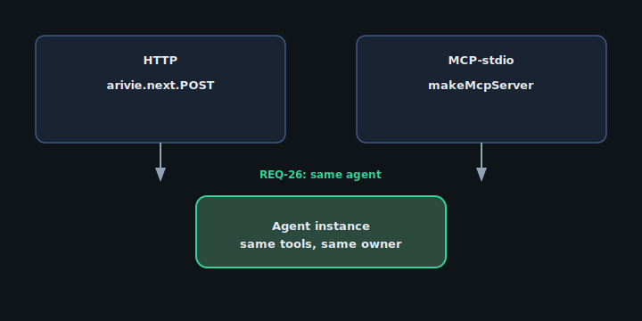

import { Code } from '@astrojs/starlight/components';
import arivieConfig from '../../../../../examples/with-nextjs/arivie.config.ts?raw';

## When to use this

Use **audit routing** when compliance or support needs a per-decision log: which tool ran, with what args summary, plus the SQL and row count after execution. Lifecycle hooks on the analytics plugin route events to **your** pipeline (Axiom, Datadog, S3, etc.).

## Architecture



Base example: [`examples/with-nextjs/`](https://github.com/openscoped/data-agent/tree/main/arivie/examples/with-nextjs).

## Reference config

The v2 app shape — analytics options live on the plugin:

<Code code={arivieConfig} lang="typescript" title="arivie.config.ts" />

Hook wiring (`onToolCall`, `onAfterQuery`) on `defineArivie` is **planned** for the plugin manifest layer. Until then, instrument at the host app by reading `ArivieEvent` streams from `arivie.sessions.create` or the durable `/runs/:id/events` cursor API.

## Run it

```bash
cd arivie && pnpm install
pnpm --filter with-nextjs dev
```
