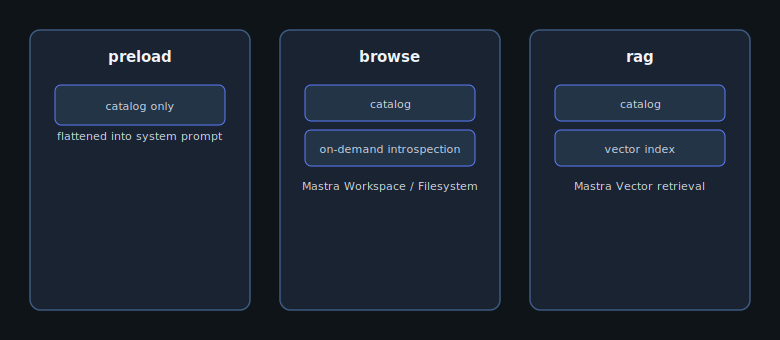

## When to use this

Apply **cost guardrails** when you need hard ceilings on agent spend: fewer rows returned per `execute`, shorter SQL timeouts, and optional per-request token budgets before the model provider bills you. These limits are enforced inside `@arivie/agent` tools — not advisory prompts.

## Architecture



Base example: [`examples/with-nextjs/`](https://github.com/openscoped/data-agent/tree/main/arivie/examples/with-nextjs).

## Config patch

Add `limits` to `defineArivie` in `arivie.config.ts`:

```typescript
defineArivie({
  // ... owner, model, db, semantic, resolveUser
  limits: {
    rowsPerQuery: 50,
    queryTimeoutMs: 30_000,
    tokensPerRequest: 8_000,
    tokensPerUserPerMonth: null,
  },
});
```

`rowsPerQuery` and `queryTimeoutMs` apply to `execute` and `compile_metric`. `tokensPerRequest` is reserved for handler-level enforcement as the budget wiring lands in Sprint 5 CI gates (REQ-32). Pair limits with `semantic.mode: "preload"` when your catalog is small to avoid browse/RAG token overhead.

## Run it

```bash
cd arivie && pnpm install
pnpm --filter with-nextjs dev
curl -X POST http://localhost:3000/api/arivie -H 'Content-Type: application/json' -d '{"prompt":"How many customers?"}'
```

Stress-test with a wide `SELECT` prompt and confirm the agent respects `rowsPerQuery` in the returned result set.
