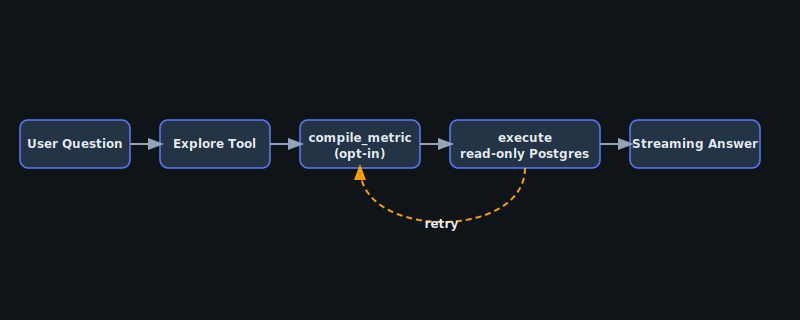

import { Code } from '@astrojs/starlight/components';
import appTs from '../../../../../examples/with-hono/src/app.ts?raw';

## When to use this

Use **Hono** when you want a lightweight Node HTTP server (API-only backend, edge-adjacent services, or a custom framework stack) without pulling in Next.js. The example mounts `arivie.next.POST` on `POST /api/arivie` and reuses the same `arivie.config.ts` + semantic layer as the Next.js reference.

## Architecture



The handler shape is identical to Next.js; only the HTTP framework entry point differs.

## Code snippet

<Code code={appTs} lang="typescript" title="src/app.ts" />

## Run it

```bash
cd arivie && pnpm install
pnpm --filter with-hono dev
curl -X POST http://localhost:3000/api/arivie -H 'Content-Type: application/json' -d '{"prompt":"How many customers?"}'
```

Canonical tree: [`arivie/examples/with-hono/`](https://github.com/openscoped/data-agent/tree/main/arivie/examples/with-hono).
