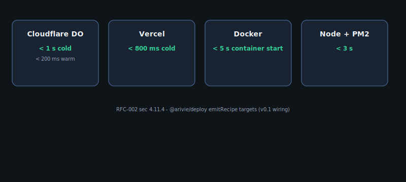

## When to use this

Use **multi-region DO routing** when each owner (or each geography) should run on a Durable Object colocated with their Postgres read replica. You still deploy **one Arivie instance per owner** (no shared mode); the Worker only picks which named DO stub receives the request.

## Architecture



Base example: [`examples/with-cloudflare-do/`](https://github.com/openscoped/data-agent/tree/main/arivie/examples/with-cloudflare-do).

## Config patch

Extend `wrangler.toml` with one DO binding per region (names illustrative):

```toml
[[durable_objects.bindings]]
name = "ARIVIE_DO_EU"
class_name = "ArivieDO"

[[durable_objects.bindings]]
name = "ARIVIE_DO_US"
class_name = "ArivieDO"
```

In `src/worker.ts`, derive the stub name from `request.cf?.colo` or an `X-Arivie-Region` header your gateway sets:

```typescript
const region = request.headers.get("X-Arivie-Region") ?? "us";
const binding =
  region === "eu" ? env.ARIVIE_DO_EU : env.ARIVIE_DO_US;
const id = binding.idFromName(ownerId);
return binding.get(id).fetch(request);
```

Each DO continues to call `getArivieRuntime(env)` with region-specific `DATABASE_URL` secrets. No new example directory is required — patch the canonical CF DO example.

## Run it

```bash
cd arivie && pnpm install
pnpm --filter with-cloudflare-do build
wrangler dev
curl -X POST http://127.0.0.1:8787/api/arivie -H 'X-Arivie-Region: eu' -H 'Content-Type: application/json' -d '{"prompt":"How many customers?"}'
```
