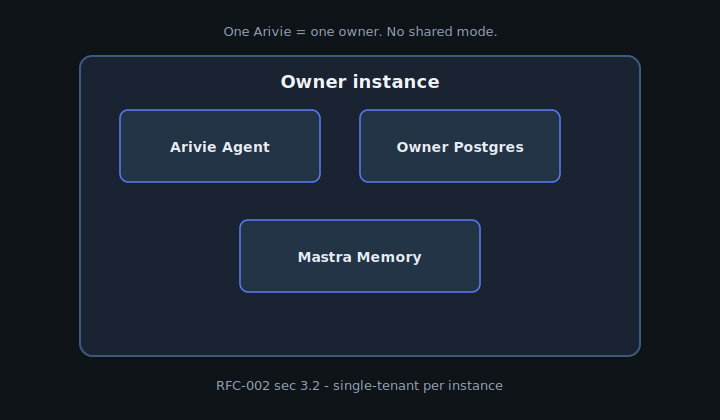

import { Code } from '@astrojs/starlight/components';
import routeTs from '../../../../../examples/with-nextjs/app/api/arivie/route.ts?raw';

## When to use this

Choose the **Next.js** recipe when your product is already on the App Router and you want the canonical path: `defineArivie` in `arivie.config.ts`, a thin `app/api/arivie/route.ts`, optional MCP at `app/api/arivie/mcp/route.ts`, and `@arivie/react` on the page. This is the reference integration the quickstart and Puppeteer harness exercise.

## Architecture



HTTP clients and the in-app chat both call the same runtime from `getArivieRuntime()`. MCP parity is documented in the [MCP equivalence](/concepts/mcp-equivalence/) concept page.

## Code snippet

The API route delegates to the shared runtime — no duplicate agent construction in the route file:

<Code code={routeTs} lang="typescript" title="app/api/arivie/route.ts" />

## Run it

```bash
cd arivie && pnpm install
pnpm --filter with-nextjs dev
curl -X POST http://localhost:3000/api/arivie -H 'Content-Type: application/json' -d '{"prompt":"How many customers?"}'
```

Canonical tree: [`arivie/examples/with-nextjs/`](https://github.com/openscoped/data-agent/tree/main/arivie/examples/with-nextjs).
